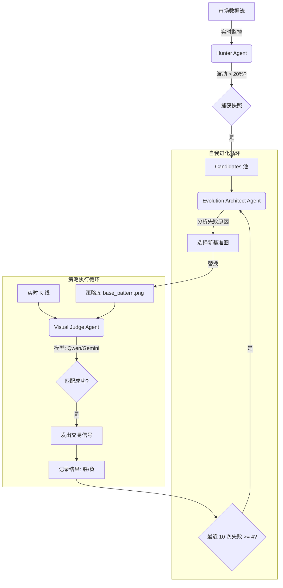

# K-Line Evolutionary Trading Agent (KETA)

## 📖 项目概述

KETA 是一个基于**多模态大模型**的自进化交易代理系统。它不依赖任何技术指标，仅通过**裸 K 线（Raw Candlestick）**的视觉模式识别来进行交易决策。

系统的核心理念是**"优胜劣汰 + 特征收敛"**：通过监控市场大幅波动事件，利用多模态大模型进行视觉比对和策略生成，并根据实战表现自动淘汰低效策略、进化出更精准的模式识别能力。

---

## 🌟 核心设计理念

### 1. 事件驱动的进化机制
- **拒绝固定时间间隔**：不像通用 Agent 每 N 次对话进化一次，KETA 仅在**市场发生显著波动**（如涨跌幅 > 20%）时触发进化。
- **高价值样本**：只学习那些真正产生大幅利润或亏损的关键时刻，避免噪声数据污染策略。

### 2. 纯多模态视觉匹配 (No Vector Embedding)
- **不使用传统向量数据库**：不将 K 线图转化为数值向量进行相似度计算。
- **MLLM 视觉推理**：直接调用 **Qwen3.6-Plus** 或 **Gemini-2.0-Pro** 等多模态大模型，让模型像人类交易员一样"看图识势"。
- **优势**：能够理解复杂的形态结构（如"早晨之星"、"吞没形态"的变体），而不仅仅是像素相似度。

### 3. 动态自我进化逻辑
- **绩效监控**：每个策略记录最近 10 次匹配结果。
- **淘汰机制**：如果 10 次中有 **4 次以上** 未能抓住预期的 20% 涨幅（误报或漏报），触发进化。
- **特征收敛**：
  1. 收集失败案例的 K 线图。
  2. 调用 **Evolution Architect Agent** 分析失败原因。
  3. 从历史候选池中选择一个与失败案例有共性、但历史上表现更好的 K 线图作为**新基准图**。
  4. 替换策略的 `base_pattern.png`，完成进化。

### 4. 多模型共识机制
- **双模型对比**：支持配置 **Qwen3.6-Plus** 和 **Gemini-2.0-Pro**。
- **模式切换**：
  - `single`: 仅使用单一模型（速度快，成本低）。
  - `consensus`: 双模型独立判断，仅当两者都确认匹配时才执行（高置信度，低误报）。
- **可热切换**：可在配置文件或命令行中动态选择当前使用的模型。

---

## 🏗️ 系统架构

### 架构图



### 核心组件

#### 1. Hunter Agent (猎手)
- **职责**：7x24 小时监控市场，检测波动事件。
- **触发条件**：指定时间窗口内涨跌幅超过阈值（默认 20%）。
- **动作**：保存波动发生**前**的 K 线截图到 `data/candidates/`，作为潜在的进化素材。

#### 2. Visual Judge Agent (视觉裁判)
- **职责**：实时交易决策。
- **输入**：当前市场 K 线图 + 策略基准图 (`base_pattern.png`)。
- **模型**：可配置为 Qwen3.6-Plus 或 Gemini-2.0-Pro。
- **输出**：`MATCH` (执行交易) 或 `NO_MATCH` (观望)。
- **逻辑**：提示词引导模型判断"当前图表是否与基准图具有相同的上涨/下跌潜力"。

#### 3. Evolution Architect Agent (进化架构师)
- **职责**：策略优化与重生。
- **触发**：策略绩效低于阈值时。
- **输入**：失败案例集 + 候选池历史数据。
- **逻辑**：
  - 分析为什么之前的基准图失效了？（是市场环境变了？还是形态细节不同？）
  - 从候选池中挑选一张新的、更具代表性的 K 线图。
- **输出**：更新策略目录下的 `base_pattern.png`。

#### 4. Strategy Manager (策略管家)
- **职责**：管理策略生命周期、存储 manifest.json、记录绩效日志。
- **存储结构**：
  ```text
  strategies/
  └── btc_usd_20231027/
      ├── base_pattern.png    # 核心：被比对的基准图
      ├── manifest.json       # 参数：入场/出场/仓位/绩效日志
      └── evolution_log.txt   # 记录每次进化的原因和新图来源
  ```

---

## 🛠️ 技术栈

- **语言**: Python 3.9+
- **多模态模型**:
  - `Qwen3.5-Plus` (阿里云 DashScope)
  - `Gemini-2.0-Pro` (Google Generative AI)
- **数据源**: `ccxt` (支持 Binance, OKX 等百家交易所)
- **图表渲染**: `mplfinance` (生成标准 K 线图)
- **配置管理**: `pydantic` + YAML/JSON
- **并发处理**: `asyncio` (非阻塞监控)

---

## 🚀 快速开始

### 1. 环境准备

```bash
cd trading-agent
pip install -r requirements.txt
```

### 2. 配置模型

编辑 `config.yaml` 或直接在命令行指定模型：

```yaml
models:
  qwen:
    provider: dashscope
    model_name: qwen-vl-max-latest  # 对应 Qwen3.6-Plus 能力
    api_key: ${DASHSCOPE_API_KEY}
  
  gemini:
    provider: google
    model_name: gemini-2.0-pro-exp-02-05
    api_key: ${GOOGLE_API_KEY}

system:
  default_model: qwen       # 默认使用 Qwen
  mode: consensus           # 或 'single'
  volatility_threshold: 0.2 # 20% 波动触发
```

### 3. 运行流程

#### 步骤 A: 启动猎手 (积累素材)
后台运行，自动捕获大幅波动前的 K 线图。
```bash
python agents/hunter_agent.py --symbol BTC/USDT --timeframe 1h
```

#### 步骤 B: 初始化策略
从捕获的素材中手动选择一个作为初始策略。
```bash
python main.py --mode init --candidate event_20231027_143022_1 --symbol BTC/USDT
```

#### 步骤 C: 启动交易监控 (带进化)
启动主循环，自动判断、自动记录、自动进化。
```bash
# 使用 Qwen 单模型模式
python main.py --mode monitor --symbol BTC/USDT --model qwen

# 使用双模型共识模式 (推荐实盘)
python main.py --mode monitor --symbol BTC/USDT --mode consensus
```

---

## 🧬 进化机制详解

这是本项目的核心创新点。

### 阶段 1: 绩效追踪
每次 `Visual Judge` 判定匹配并产生交易后，系统会跟踪该笔交易的结果：
- **Success**: 随后确实出现了 >20% 的涨幅。
- **Fail**: 随后行情震荡或反向，未达预期。

数据记录在 `manifest.json` 的 `performance_log` 中：
```json
"performance_log": [
  {"timestamp": "...", "result": "success"},
  {"timestamp": "...", "result": "fail"},
  ...
]
```

### 阶段 2: 触发进化
当 `performance_log` 中最近 10 条记录里，`fail` 数量 ≥ 4 时：
1. 锁定当前策略，暂停交易。
2. 提取最近 4 次失败的 K 线图快照。
3. 调用 `Evolution Architect`。

### 阶段 3: 架构师决策
Prompt 示例：
> "当前策略基准图 A 在最近 10 次匹配中失败了 4 次。这是失败的 4 张图 (Image B, C, D, E)。
> 请分析 A 与 B,C,D,E 的差异。
> 从历史候选池 (Pool X, Y, Z...) 中，选出一张最能代表'真实上涨形态'且能区分这些失败案例的新图片 F。
> 解释选择 F 的理由。"

### 阶段 4: 迭代
- 将 `base_pattern.png` 替换为 F。
- 清空短期绩效记录（或保留部分加权）。
- 恢复交易，开始新一轮验证。

---

## ⚙️ 配置说明

### 模型切换
系统支持运行时切换模型，无需重启（针对新请求生效）：
- **Qwen3.6-Plus**: 对中文语境和亚洲市场 K 线形态理解较好，响应速度快。
- **Gemini-2.0-Pro**: 拥有极强的长上下文和复杂图像推理能力，适合分析复杂形态。

### 阈值调整
- `volatility_threshold`: 触发进化的波动幅度（默认 0.2 即 20%）。
- `evolution_fail_rate`: 触发进化的失败率（默认 0.4 即 4/10）。
- `match_confidence`: 模型判定的置信度阈值（需在 Prompt 中定义）。

---

## ⚠️ 风险提示

1. **实验性质**: 本系统基于概率和大模型推理，**不保证盈利**。
2. **幻觉风险**: 多模态模型可能产生视觉幻觉，误判形态。建议初期使用 `consensus` 模式降低风险。
3. **延迟问题**: 依赖 API 调用，网络延迟可能影响高频交易场景（本项目定位为波段交易，非高频）。
4. **资金安全**: 目前版本仅输出**交易信号**，不直接对接交易所下单接口。如需自动化交易，请自行开发执行模块并严格测试。

---

## 📂 目录结构

```text
trading-agent/
├── config.yaml             # 全局配置 (模型/API/阈值)
├── main.py                 # 入口程序
├── requirements.txt        # 依赖列表
├── README.md               # 本文档
├── agents/
│   ├── hunter_agent.py     # 波动监控与素材捕获
│   ├── multi_agent_system.py # MLLM 封装 (Qwen/Gemini)
│   └── evolution_logic.py  # 进化算法实现
├── core/
│   ├── strategy_manager.py # 策略 CRUD 与绩效统计
│   └── chart_renderer.py   # K 线图生成工具
├── data/
│   ├── candidates/         # 待选的波动事件快照
│   └── cache/              # 临时缓存
└── strategies/             # 活跃策略目录
    └── [strategy_id]/
        ├── base_pattern.png
        └── manifest.json
```

---

## 🤝 贡献与开发

欢迎提交 Issue 和 PR。未来的开发方向包括：
- 支持更多多模态模型 (Claude 3.5 Sonnet, Llama 3.2 Vision)。
- 增加回测模块，验证进化算法的历史表现。
- 对接交易所 API 实现全自动闭环交易。

---

**License**: MIT
**Author**: KETA Team
**Date**: 2024
